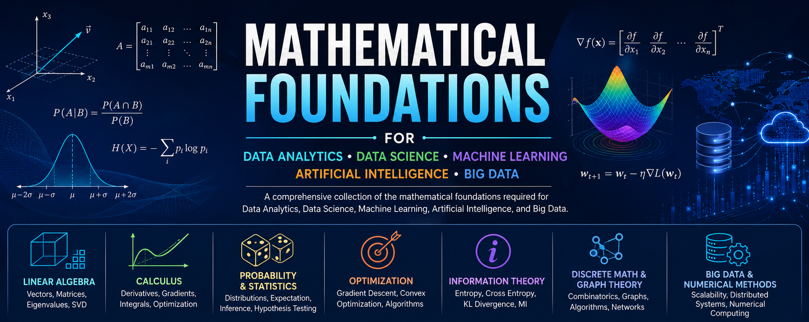

# Applied-Mathematics-for-Data-Science-AI-and-Big-Data
A comprehensive collection of the mathematical foundations required for Data Analytics, Data Science, Machine Learning, Artificial Intelligence, and Big Data.

___
# 📘 Mathematical Foundations for Data Analytics, Data Science, Machine Learning, Artificial Intelligence, and Big Data

## Table of Contents

---

# Part I – Mathematical Foundations

## 1. Fundamentals of Mathematics
### 1.1 Sets
- Set Operations
- Cartesian Product
- Relations
- Functions
- Number Systems

### 1.2 Mathematical Logic
- Propositions
- Truth Tables
- Predicate Logic
- Quantifiers
- Proof Techniques

### 1.3 Mathematical Notation
- Sigma Notation
- Product Notation
- Factorials
- Binomial Coefficients
- Mathematical Symbols

---

# Part II – Linear Algebra

## 2. Scalars, Vectors, and Matrices
### 2.1 Scalars
### 2.2 Vectors
- Vector Operations
- Unit Vectors
- Vector Norms
- Distance Metrics

### 2.3 Matrices
- Matrix Types
- Matrix Operations
- Matrix Multiplication
- Matrix Inverse
- Matrix Rank
- Matrix Trace
- Determinants

### 2.4 Systems of Linear Equations
### 2.5 Linear Transformations

### 2.6 Vector Spaces
- Basis
- Dimension
- Subspaces

### 2.7 Orthogonality
- Orthogonal Vectors
- Orthogonal Projection
- Gram-Schmidt Process

### 2.8 Eigenvalues and Eigenvectors

### 2.9 Matrix Decomposition
- LU Decomposition
- QR Decomposition
- Cholesky Decomposition
- Eigen Decomposition
- Singular Value Decomposition (SVD)

### 2.10 Positive Definite Matrices
### 2.11 Tensor Algebra

---

# Part III – Calculus

## 3. Single Variable Calculus
### 3.1 Functions
### 3.2 Limits
### 3.3 Continuity
### 3.4 Differentiation
### 3.5 Higher-Order Derivatives
### 3.6 Taylor Series
### 3.7 Maclaurin Series

## 4. Multivariable Calculus
### 4.1 Partial Derivatives
### 4.2 Total Derivatives
### 4.3 Gradient
### 4.4 Directional Derivatives
### 4.5 Jacobian Matrix
### 4.6 Hessian Matrix
### 4.7 Chain Rule
### 4.8 Multiple Integrals

### 4.9 Vector Calculus
- Divergence
- Curl
- Line Integrals
- Surface Integrals

## 5. Differential Equations
### 5.1 Ordinary Differential Equations (ODE)
### 5.2 Partial Differential Equations (PDE)
### 5.3 Numerical Solutions

---

# Part IV – Probability Theory

## 6. Fundamentals of Probability
### 6.1 Random Experiments
### 6.2 Sample Space
### 6.3 Events
### 6.4 Probability Axioms
### 6.5 Conditional Probability
### 6.6 Independence
### 6.7 Bayes' Theorem

## 7. Random Variables
### 7.1 Discrete Random Variables
### 7.2 Continuous Random Variables
### 7.3 Probability Mass Function (PMF)
### 7.4 Probability Density Function (PDF)
### 7.5 Cumulative Distribution Function (CDF)

## 8. Probability Distributions

### Discrete Distributions
- Bernoulli
- Binomial
- Geometric
- Negative Binomial
- Poisson
- Hypergeometric
- Multinomial

### Continuous Distributions
- Uniform
- Gaussian (Normal)
- Exponential
- Gamma
- Beta
- Chi-Square
- Student's t
- Weibull
- Laplace
- Logistic
- Pareto
- Dirichlet

## 9. Moments
- Mean
- Variance
- Covariance
- Correlation
- Expectation
- Central Moments
- Skewness
- Kurtosis

## 10. Joint Probability
- Joint Distribution
- Marginal Distribution
- Conditional Distribution
- Covariance Matrix

## 11. Stochastic Processes
- Markov Chains
- Hidden Markov Models
- Random Walks
- Poisson Process
- Brownian Motion

---

# Part V – Statistics

## 12. Descriptive Statistics
- Mean
- Median
- Mode
- Quartiles
- Percentiles
- Variance
- Standard Deviation
- Interquartile Range
- Outliers

## 13. Sampling
- Population
- Sample
- Sampling Methods
- Sampling Distribution
- Central Limit Theorem
- Law of Large Numbers

## 14. Statistical Inference
- Point Estimation
- Confidence Intervals
- Maximum Likelihood Estimation (MLE)
- Maximum A Posteriori Estimation (MAP)
- Bayesian Estimation

## 15. Hypothesis Testing
- Null and Alternative Hypotheses
- p-value
- Type I Error
- Type II Error
- z-test
- t-test
- Chi-Square Test
- ANOVA
- Non-Parametric Tests

## 16. Regression Analysis
- Linear Regression
- Multiple Regression
- Polynomial Regression
- Logistic Regression
- Generalized Linear Models (GLM)

---

# Part VI – Optimization

## 17. Optimization Fundamentals
- Objective Functions
- Constraints
- Convex Sets
- Convex Functions

## 18. Optimization Algorithms
- Gradient Descent
- Stochastic Gradient Descent (SGD)
- Mini-Batch Gradient Descent
- Momentum
- Nesterov Momentum
- AdaGrad
- RMSProp
- Adam
- AdamW
- L-BFGS
- Newton's Method

## 19. Constrained Optimization
- Lagrange Multipliers
- KKT Conditions
- Duality

---

# Part VII – Information Theory

## 20. Information Measures
- Self Information
- Entropy
- Joint Entropy
- Conditional Entropy
- Cross Entropy
- Relative Entropy
- KL Divergence
- Jensen-Shannon Divergence
- Mutual Information
- Information Gain

## 21. Coding Theory
- Huffman Coding
- Arithmetic Coding
- Source Coding

---

# Part VIII – Numerical Methods

## 22. Numerical Computing
- Floating Point Arithmetic
- Numerical Stability
- Error Analysis
- Approximation
- Interpolation
- Root Finding

## 23. Numerical Linear Algebra
- Iterative Solvers
- Sparse Matrices
- Matrix Factorization
- Eigenvalue Computation

---

# Part IX – Discrete Mathematics

## 24. Combinatorics
- Permutations
- Combinations
- Counting Principles
- Inclusion–Exclusion Principle

## 25. Graph Theory
- Graphs
- Directed Graphs
- Weighted Graphs
- Trees
- DAGs
- Bipartite Graphs
- Connectivity
- Paths
- Cycles
- Graph Traversal
- Shortest Path Algorithms
- Minimum Spanning Trees
- Network Flow

## 26. Boolean Algebra
- Logic Gates
- Boolean Functions
- Boolean Simplification

---

# Part X – Geometry

## 27. Euclidean Geometry
- Distance
- Angles
- Coordinate Geometry

## 28. Analytic Geometry
- Hyperplanes
- Affine Spaces
- Convex Hulls

## 29. High-Dimensional Geometry
- Cosine Similarity
- Euclidean Distance
- Manhattan Distance
- Mahalanobis Distance
- Minkowski Distance

---

# Part XI – Advanced Mathematics

## 30. Real Analysis
- Sequences
- Series
- Convergence
- Continuity
- Metric Spaces

## 31. Convex Analysis
- Convex Optimization
- Subgradients
- Fenchel Duality

## 32. Measure Theory
- Sigma Algebra
- Measurable Functions
- Lebesgue Measure
- Lebesgue Integration

## 33. Functional Analysis
- Normed Spaces
- Banach Spaces
- Hilbert Spaces

## 34. Information Geometry
- Fisher Information
- Fisher Information Matrix
- Natural Gradient
- Statistical Manifolds

---

# Part XII – Signal Processing

## 35. Signals
- Continuous Signals
- Discrete Signals

## 36. Fourier Analysis
- Fourier Series
- Fourier Transform
- Discrete Fourier Transform (DFT)
- Fast Fourier Transform (FFT)

## 37. Wavelets
- Continuous Wavelet Transform
- Discrete Wavelet Transform

---

# Part XIII – Graph and Network Mathematics

## 38. Spectral Graph Theory
- Graph Laplacian
- Eigenvalues of Graphs
- Graph Embeddings

## 39. Network Science
- Centrality Measures
- Community Detection
- Random Graphs
- Small-World Networks
- Scale-Free Networks

---

# Part XIV – Big Data Mathematics

## 40. Distributed Mathematics
- Distributed Matrix Operations
- Parallel Algorithms
- Distributed Optimization

## 41. Streaming Algorithms
- Reservoir Sampling
- Bloom Filters
- Count-Min Sketch
- HyperLogLog

## 42. Hashing Mathematics
- Universal Hashing
- Locality Sensitive Hashing (LSH)
- Consistent Hashing
- MinHash
- SimHash

## 43. Dimensionality Reduction
- Principal Component Analysis (PCA)
- Kernel PCA
- Independent Component Analysis (ICA)
- Random Projection
- Multidimensional Scaling (MDS)
- t-SNE
- UMAP

---

# Part XV – Machine Learning Mathematics

## 44. Loss Functions
- Mean Squared Error (MSE)
- Mean Absolute Error (MAE)
- Huber Loss
- Binary Cross Entropy
- Categorical Cross Entropy
- Hinge Loss
- Focal Loss
- KL Divergence Loss
- Contrastive Loss
- Triplet Loss

## 45. Similarity Measures
- Cosine Similarity
- Euclidean Distance
- Manhattan Distance
- Mahalanobis Distance
- Jaccard Similarity
- Pearson Correlation
- Spearman Correlation

## 46. Kernel Methods
- Linear Kernel
- Polynomial Kernel
- Radial Basis Function (RBF)
- Sigmoid Kernel

## 47. Deep Learning Mathematics
- Activation Functions
- Computational Graphs
- Backpropagation
- Automatic Differentiation
- Batch Normalization
- Regularization
- Dropout
- Weight Initialization
- Attention Mathematics
- Positional Encoding
- Softmax Function
- Embeddings
- Transformer Mathematics

## 48. Reinforcement Learning Mathematics
- Markov Decision Processes (MDP)
- Bellman Equation
- Value Functions
- Policy Functions
- Dynamic Programming
- Monte Carlo Methods
- Temporal Difference Learning

---

# Part XVI – Data Analytics & Data Science Mathematics

## 49. Data Preprocessing Mathematics
- Feature Scaling
- Standardization
- Normalization
- Missing Value Imputation
- Feature Encoding

## 50. Time Series Mathematics
- Trend
- Seasonality
- Stationarity
- Autocorrelation
- AR
- MA
- ARMA
- ARIMA
- SARIMA
- Exponential Smoothing

## 51. Clustering Mathematics
- k-Means
- Hierarchical Clustering
- DBSCAN
- Gaussian Mixture Models (GMM)

## 52. Association Rule Mining
- Support
- Confidence
- Lift
- Apriori Algorithm
- FP-Growth

---

# Appendices

## A. Mathematical Symbols

## B. AI Formula Sheet

## C. Matrix Calculus Cheat Sheet

## D. Probability Distribution Cheat Sheet

## E. Optimization Cheat Sheet

## F. Information Theory Cheat Sheet

## G. Distance Metrics Cheat Sheet

## H. Important Mathematical Identities

## I. Complexity Analysis & Big-O Notation